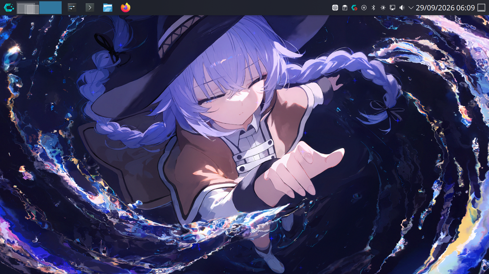
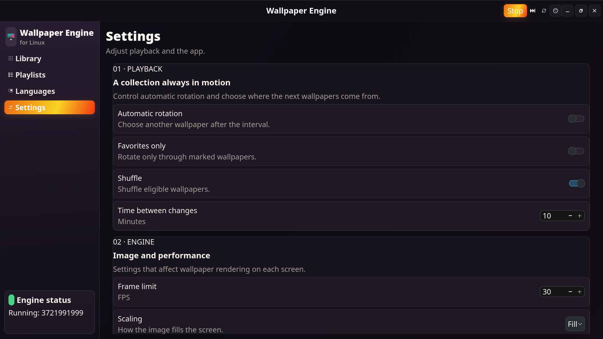
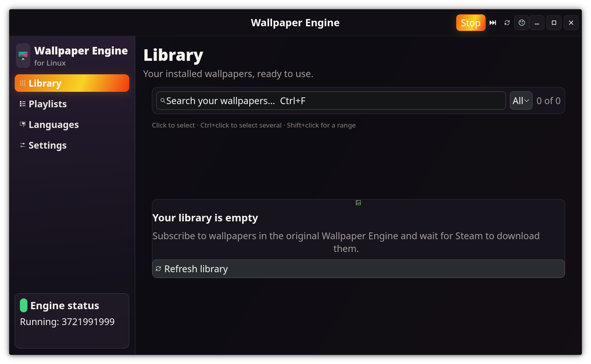
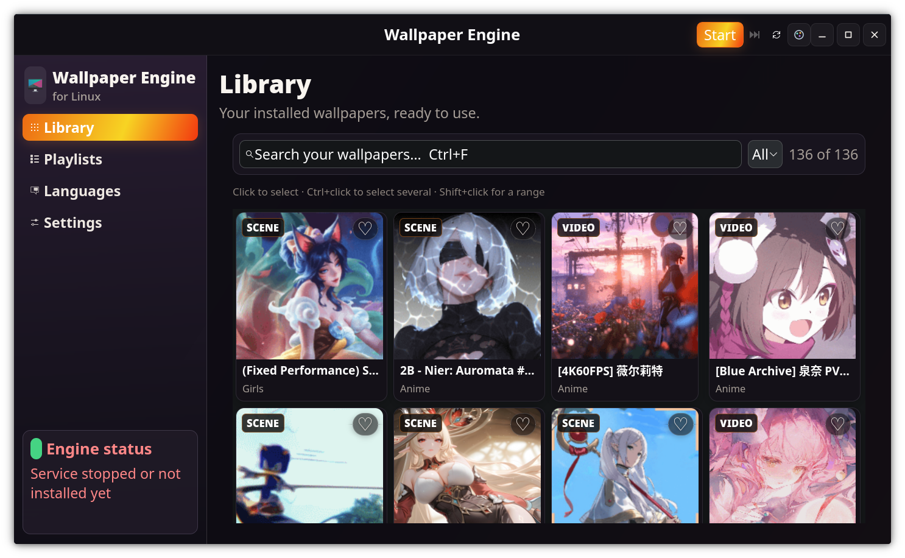

# Linux Wallpaper Engine

Run animated Wallpaper Engine wallpapers on Linux with the upstream OpenGL
renderer and this fork's optional GTK 4 desktop controller.

This repository is a fork of
[Almamu/linux-wallpaperengine](https://github.com/Almamu/linux-wallpaperengine).
The renderer is the original project's work; the GTK desktop app, its user
service, playlists, and related controls are additions maintained here. See
the [upstream README](https://github.com/Almamu/linux-wallpaperengine#readme)
for renderer-specific build prerequisites and the full command-line reference.

## Screenshots

The populated-library image was captured while the renderer was stopped; the
other app images show the running state indicated in the app.

### Wallpaper on the desktop



For the complete change inventory and upstream review notes, see
[`docs/FORK_CHANGES.md`](docs/FORK_CHANGES.md).

### GTK desktop controller







## What this fork adds

The GTK 4 app provides:

- A searchable library of locally downloaded Workshop projects, with previews,
  favorites, and scene/video filters.
- Playlists that can be created, renamed, reordered, and used for automatic
  wallpaper rotation. Wallpapers can be pinned to individual displays.
- Start, stop, and next controls, plus settings for rotation, shuffle, interval,
  frame rate, scaling, and audio mute.
- A user-level `systemd` service that keeps wallpapers running when the app
  window closes.
- English, Portuguese, German, Russian, Japanese, Chinese, Spanish, and Hindi
  interface translations, along with accent-color controls.

Subscribe to wallpapers in the original Wallpaper Engine app on Steam. Steam
downloads the subscribed projects; this app reads those local files and refreshes
its library. It does not download Workshop content itself or replace Steam.

## Compatibility

- KDE Plasma is the desktop environment tested with this controller and
  renderer.
- On Wayland, wallpaper rendering requires compositor support for
  `wlr-layer-shell`; monitor discovery on KDE Plasma Wayland uses
  `kscreen-doctor`.
- GNOME/Mutter on Wayland does not provide the renderer's required
  `wlr-layer-shell` protocol, so wallpaper rendering there is not supported.
- On X11, monitor discovery uses `xrandr`. A compositor or desktop that paints
  over the root background can hide the rendered wallpaper.
- The renderer requires a working OpenGL setup. The specific dependencies and
  supported options are documented by the
  [upstream project](https://github.com/Almamu/linux-wallpaperengine#readme).

## Install

Choose the prebuilt AppImage or build the renderer and desktop app from source.

### AppImage release (x86_64)

Download the latest `.AppImage` and matching `.sha256` file from the
[Releases page](https://github.com/xoykor/linux-wallpaperengine/releases/latest).
Save both into the same directory, with only the version you are installing
there. Verify the download, make it executable, and launch it:

```bash
sha256sum --check linux-wallpaperengine-desktop-v*-x86_64.AppImage.sha256
chmod +x linux-wallpaperengine-desktop-v*-x86_64.AppImage
./linux-wallpaperengine-desktop-v*-x86_64.AppImage
```

The AppImage bundles the GTK frontend, renderer, and CEF runtime. The host still
needs Python 3, PyGObject, GTK 4/GdkPixbuf introspection, GTK 3/NSS, OpenGL
drivers, and shared libraries used by the renderer. See the
[AppImage runtime notes](packaging/appimage/README.md) for details. Steam and
the wallpapers downloaded through Steam are not included.

### Build from source

The desktop app uses a `linux-wallpaperengine` renderer installed in `PATH` or
`~/.local/bin`. Follow the
[upstream instructions](https://github.com/Almamu/linux-wallpaperengine#readme)
for renderer dependencies and Steam asset discovery. To build the renderer
from this checkout, clone with submodules, configure, and build:

```bash
git clone --recurse-submodules https://github.com/xoykor/linux-wallpaperengine.git
cd linux-wallpaperengine
cmake -S . -B build -DCMAKE_BUILD_TYPE=Release
cmake --build build --parallel
```

Install it under your home directory and make the executable discoverable by
the app:

```bash
cmake --install build --prefix "$HOME/.local/opt/linux-wallpaperengine"
mkdir -p "$HOME/.local/bin"
ln -s "$HOME/.local/opt/linux-wallpaperengine/linux-wallpaperengine" \
  "$HOME/.local/bin/linux-wallpaperengine"
```

The CMake configure step downloads the matching Chromium Embedded Framework
distribution and needs network access. If a package manager already installed
the renderer, skip the renderer build and install steps.

### Install the desktop app

The app requires Python 3, PyGObject with GTK 4 introspection, and a working
user `systemd` manager. Install monitor discovery for your session as well:
`kscreen-doctor` on KDE Plasma Wayland or `xrandr` on X11.

For example, on Debian or Ubuntu:

```bash
sudo apt install python3 python3-gi gir1.2-gtk-4.0
# KDE Plasma monitor discovery:
sudo apt install kscreen
# X11 monitor discovery instead:
sudo apt install x11-xserver-utils
```

On Fedora, the corresponding packages are typically `python3-gobject`,
`gtk4`, `kscreen`, and `xrandr`.

From the repository root, install as your normal desktop user, without `sudo`:

```bash
./app/install.sh
```

On a first install, this adds the app to your desktop menu and enables and
starts `linux-wallpaperengine-app.service`. Launch **Linux Wallpaper Engine**
from the application menu or run:

```bash
~/.local/bin/linux-wallpaperengine-app
```

Useful service commands:

```bash
systemctl --user status linux-wallpaperengine-app.service
systemctl --user restart linux-wallpaperengine-app.service
journalctl --user -u linux-wallpaperengine-app.service -e
```

To remove the app, its menu entry, and its service while keeping your settings
and renderer:

```bash
./app/install.sh --uninstall
```

## Use the renderer directly

The GTK app is optional. The renderer can also be run from a terminal with a
Workshop ID or a path to a wallpaper directory:

```bash
linux-wallpaperengine 1845706469
linux-wallpaperengine ~/path/to/wallpaper
```

For renderer options, wallpaper properties, display selection, troubleshooting,
and additional examples, see the
[upstream command-line documentation](https://github.com/Almamu/linux-wallpaperengine#usage).

## License

This project is distributed under the GNU General Public License v3.0. See
[LICENSE](LICENSE).
